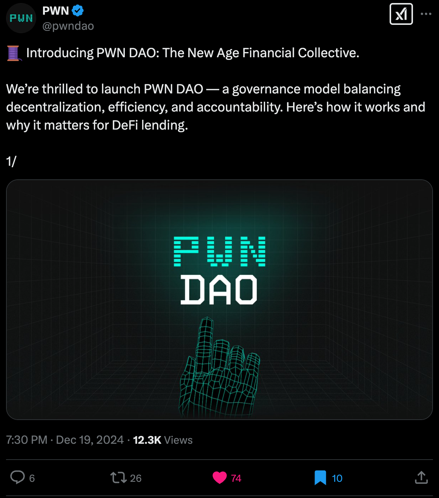

# What is PWN?

PWN is a decentralized and permissionless DeFi protocol. **Unlock the full potential of your assets** such as in-game collectibles, art or ERC-20 tokens - all of that without the risk of liquidation.

### **What problem does PWN solve?**

Traditional lending platforms like Aave enable you to leverage only a few selected tokens. With PWN, you can use all kinds of assets. **You can borrow against assets that are not supported by pool-based lending platforms.** For example, NFTs like collectibles from Play-to-earn games or any ERC-20 tokens are supported as collateral.

### How do I get started with PWN?

The most convenient way to use the PWN protocol is via our custom [web application](https://app.pwn.finance).

Currently, the PWN protocol is in the Alpha stage. That means only people with early access POAPs can use the app. To get the POAP, please register on our [waitlist](https://pwn.finance/waitlist).


Register on the waitlist even if you have the POAP. Probably nothing.


### How is the documentation organized?

Here is a high-level overview of our documentation, so you can find everything as quickly as possible.

* ****[**Guides**](broken-reference) - See how can you use the PWN protocol.&#x20;
* ****[**Fundamentals**](broken-reference) - You can learn about the core pillars PWN protocol stands on. We are here for the long run.
* ****[**Governance**](broken-reference) - How does governance in PWN DAO work?
* ****[**Use** **PWN**](broken-reference) - Try it out!
* ****[**Community**](broken-reference) - The layer 0 and most important part of any product are its users.
* ****[**Security**](security.md) **** - Audits & Bug bounty information
* There is also [**developer documentation**](https://pwn-1.gitbook.io/developer-docs/). If you're a developer and want to understand how PWN works under the hood please have a look there.&#x20;
