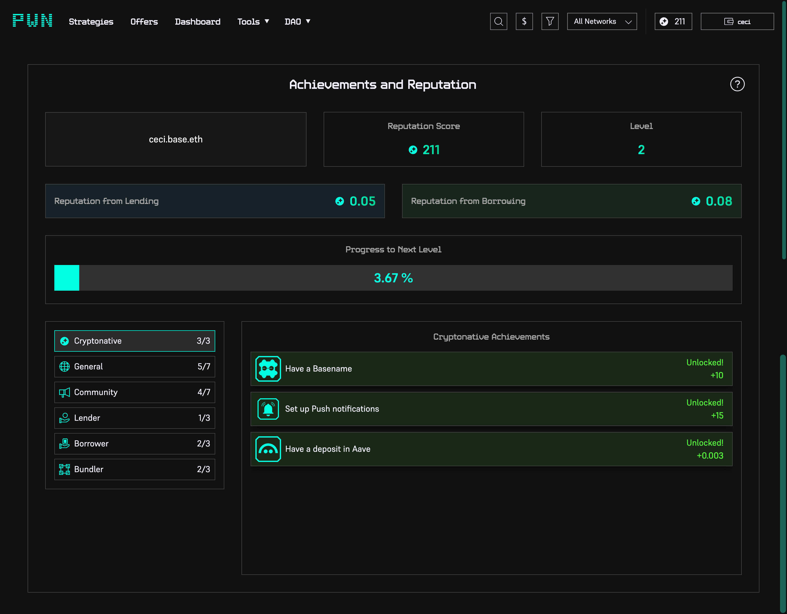

# Achievements Dashboard

You can access your achievement dashboard by tapping the ⭐️ star icon in the top right corner of our app. Below the dashboard screenshot, you’ll find descriptions explaining each section of the achievement dashboard.

<figure><figcaption></figcaption></figure>

Your reputation score reflects the total reputation points (reps) you have accumulated on the connected wallet. Besides completing achievements by using our protocol, you can also earn reps by creating social content on X.

The formula for earning reps through the protocol is: **1 Rep = $100 of volume**.

***

### Reputation from lending

You earn rep by lending, with **1 rep** awarded for **every $100** worth of tokens lent at the time the loan is created.


[reputation-points.md](incentives/reputation-points.md)


***

### Reputation from borrowing

As a borrower, you gain rep by repaying your loans. For **every $100** worth of tokens repaid, you earn **1 rep**.


[reputation-points.md](incentives/reputation-points.md)


***

### Level Progress

Level progress indicates how close you are to achieving the next level. Hovering over the bar shows how much rep you need to earn to progress.&#x20;


[levels-system.md](levels-system.md)


***

### Achievements

Achievements consist of regular or one-time tasks that allow you to earn additional reps. They are categorized into different groups, such as **Community, Lender, Borrower,** and more.
