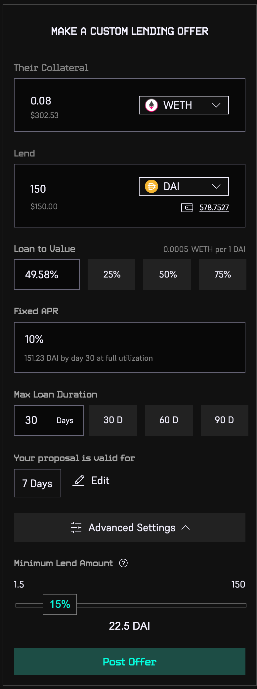
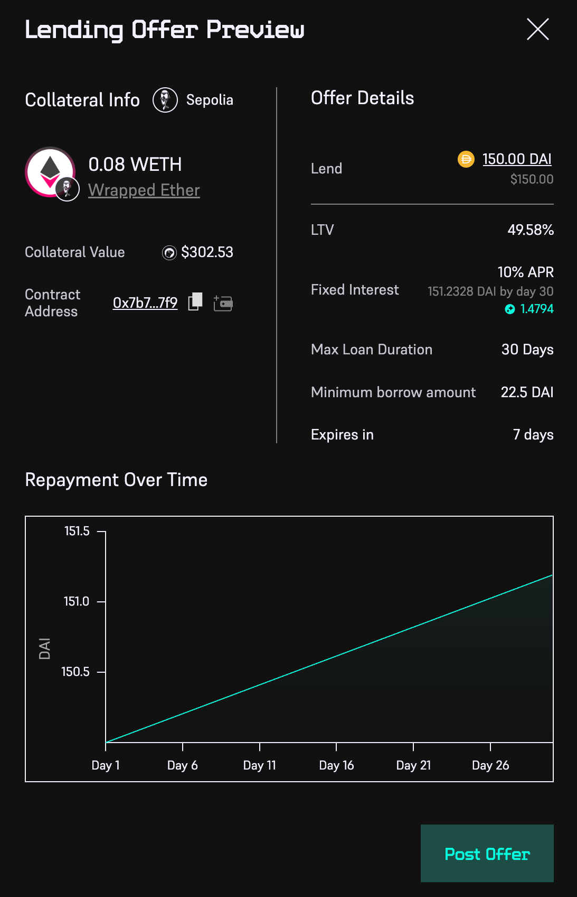

# Creating a lending offer

### You don't have to wait for a borrowing offer to be posted; you can proactively post loan offers on the collateral of your choice, and as always with PWN, on your very own terms.

1. Visit [https://app.pwn.xyz/offers/lend](https://app.pwn.xyz/offers/lend) and connect your wallet
2. Click "Make a Custom Offer" button
3. Pick a collateral and amount (tokens or NFTs) for the borrower

<figure><figcaption></figcaption></figure>

<figure><figcaption></figcaption></figure>


_After you select their collateral and/or lent asset, the app will **automatically push all matching borrowing proposals** in the "I want to lend" module on the left. If one fits your terms, just click on the "Lend" button._


4. Pick your lent asset and amount

<figure><figcaption></figcaption></figure>

<figure><figcaption></figcaption></figure>

5. Pick your desired loan terms:

* _Loan to Value_
* _Fixed APR (Interest rate)_
* _Max Loan Duration_
* _Proposal validity period_
* _Advanced Settings: adjust the Minimum Lend Amount_&#x20;

<figure><figcaption></figcaption></figure>

6. Review and click on "Post Offer" button

<figure><figcaption></figcaption></figure>

Once your lending offer is submitted, it will appear in the "Borrow" section of the Market, where any borrower will be free to accept it or counter-propose.

**⚠️ The lent asset won't leave your wallet until your lending offer  gets accepted or you accept a borrowing offer. Make sure it remains available until your offer expires or it will be invalid.**

You'll be notified in the app once when one of your offer  is accepted or if you receive a counteroffer.&#x20;

<figure><figcaption></figcaption></figure>

**⚠️ You can cancel or edit your lending offer at any time. Simply head to the "Lending" section in your Dashboard, find the offer you'd like to edit or cancel and click the corresponding button.**\
\
**⚠️ Please note that PWN only relies on time-based liquidations. Before posting a lending offer, make sure your give yourself enough buffer to account for potential asset volatility.**
