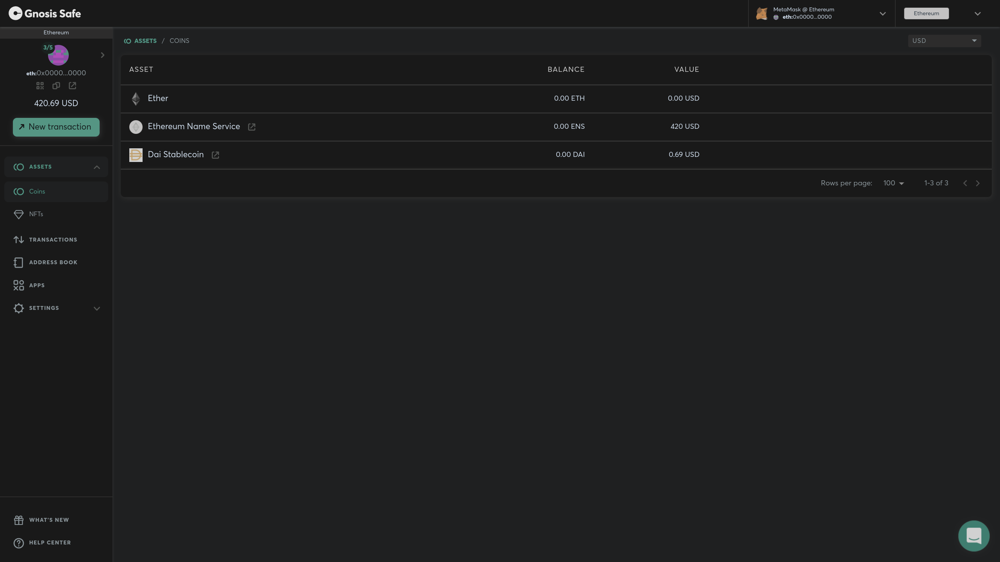
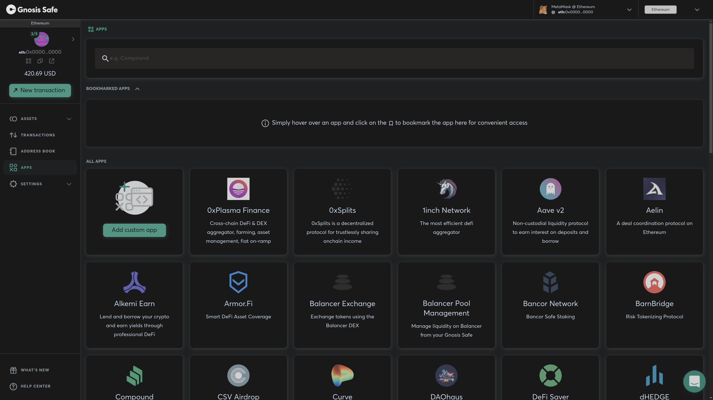
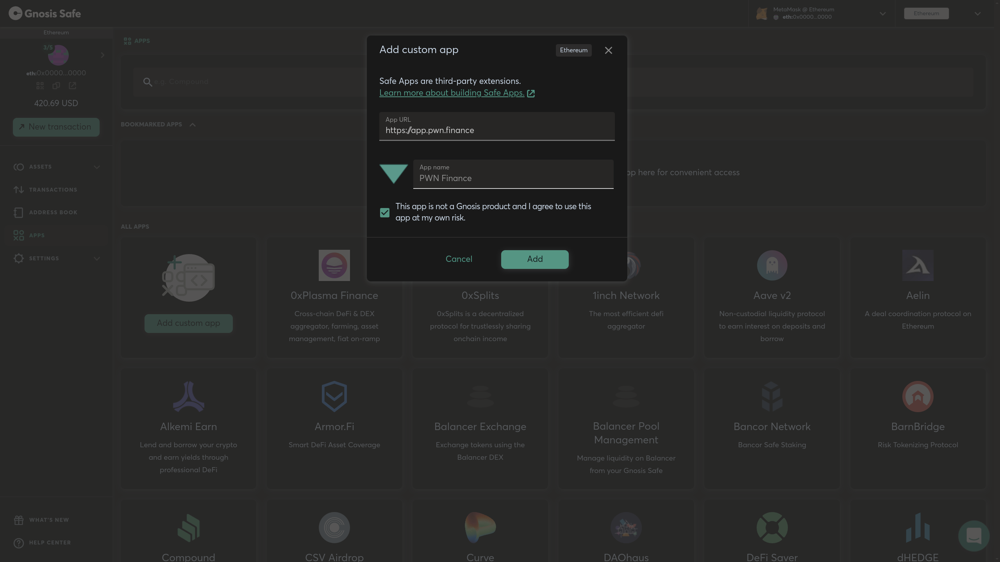

# Using PWN with Gnosis Safe

Multisig wallets are very common in the Ethereum ecosystem. The PWN web application has support for Gnosis Safe multisig. In this guide, **we will go through the process of adding PWN to your Gnosis Safe wallet.**&#x20;

### 1. Go to the _Apps_ menu

On the left side, you see the Apps menu. That is where we are going to add the PWN app to the multisig.

### 2. Click the _Add custom app_ button

### 3. Now paste the _https://app.pwn.finance/_ URL.&#x20;


Make sure there is not a # sign at the end of the URL since that will not work.


### 4. Click _Add_

### **And done!! Easy as that.**&#x20;
