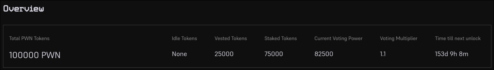
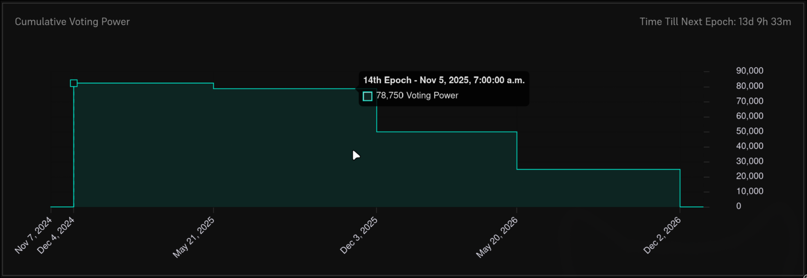
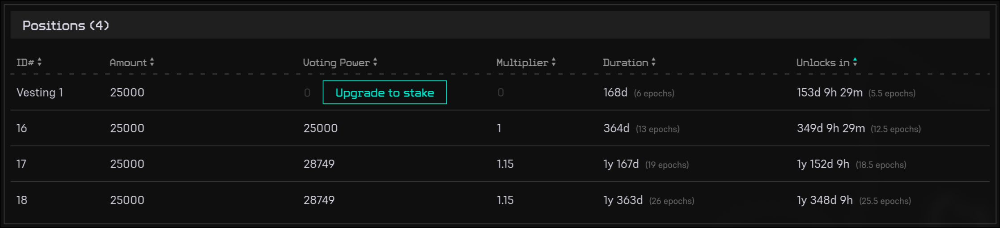

### Overview

To participate in PWN DAO governance, you must stake your PWN tokens. The staking mechanism is designed to encourage DAO members to make long-term commitments. You can manage your staking positions at [stake.pwn.xyz](https://stake.pwn.xyz).

By staking your PWN tokens, you gain:

1. **Voting Power**: The longer you stake your PWN tokens, the higher your voting multiplier becomes. You can review detailed voting multiplier information [here](pwn-dao.md#staking-and-voting-power).
2. **Potential Future Fee Sharing**: If approved by PWN DAO, stakers will receive a portion of collected fees.

Important Note: In this context, staking functions more like a token-locking mechanism. When you stake:
- You do not risk losing your tokens
- You do not earn interest on staked tokens

### Epochs: Understanding PWN DAO's Timeframe

PWN DAO operates on an epoch-based system:

- Each epoch is exactly 4 weeks long
- Staking actions (creating or extending positions) take effect in the following epoch
- The countdown to the next epoch is displayed in the top right corner of the staking UI

### Additional Resources

For comprehensive details about staking and voting power mechanics, please visit the [Staking and Voting Power documentation](pwn-dao.md#staking-and-voting-power).

---

## PWN Staking UI Guide

The PWN Staking UI provides a comprehensive overview of your staking positions, vesting positions, and unstaked PWN tokens.

### Top Bar Overview

Key metrics in the top bar include:

- **Total PWN Tokens**: Sum of staked, vested, and unstaked PWN
- **Idle Tokens**: Unstaked PWN tokens available for staking
- **Vested Tokens**: PWN tokens locked in vesting positions
- **Staked Tokens**: PWN tokens locked in staking positions
- **Current Voting Power**: Voting power in current epoch
- **Voting Multiplier**: Weighted average voting multiplier of all your staking positions
- **Time Until Next Unlock**: Countdown to when you can claim your next staking position

### Cumulative Voting Power Graph

This graph displays your cumulative voting power over time, from the current epoch to the last epoch where you maintain voting power. Changes in voting power are highlighted on the x-axis.

### Staking and Vesting Positions Table

The positions table offers insights into your token positions:

- View all staking and vesting positions
- Claim unlocked PWN tokens
- Upgrade vesting positions to standard staking positions

### Understanding Vesting Positions

Vesting positions are designed for early investors with token locks shorter than one year. These positions differ from standard staking in key ways:

- **No Voting Power**: Vested tokens do not generate voting influence
- **No Fee Shares**: Vested tokens do not earn potential fee distributions

You can choose to upgrade your vesting position to a standard staking position to get the benefits of a staking position.

#### How to upgrade vesting position to staking position:
- Click the "Upgrade to stake" button in the positions table
- Both minimal and default lockup duration is 1 year, starting from the next epoch
- For custom lockup durations, contact the team on [Discord](https://discord.pwn.xyz)

---

## Upcoming Staking UI Features

New features will be added to the Staking UI soon. These features include:

- Creating new staking positions
- Extending existing stake positions
- Increasing stake amounts
- Claiming unlocked staking positions

Need to modify your staking positions sooner? Reach out on [Discord](https://discord.pwn.xyz).